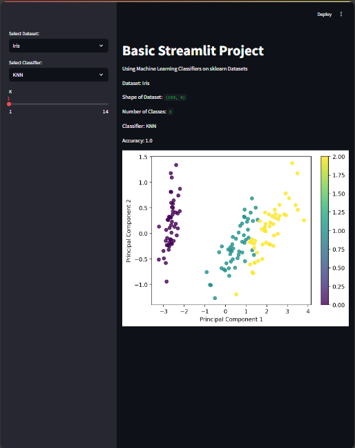

# Basic Streamlit Project with ML Classifiers

In this Streamlit project, various machine learning classifiers are applied to popular sklearn datasets. It provides an interactive interface where users can select datasets and classifiers, tune parameters, and visualize results.

## Project Features
- **Streamlit** for interactive web app development
- **Dataset Selection**: Choose between Iris, Breast Cancer, and Wine datasets from sklearn
- **Classifier Selection**: Choose from K-Nearest Neighbors (KNN), Support Vector Machine (SVM), and Random Forest
- **Parameter Tuning**: Adjust parameters specific to each classifier directly in the sidebar
- **Data Visualization**: PCA is used to reduce data to 2 dimensions, and matplotlib is used to plot the data for better understanding

## Setup
1. Install Streamlit and required libraries:
    ```bash
    pip install streamlit scikit-learn matplotlib numpy
2. Run the Streamlit app:
    ```bash
    streamlit run app.py

## How to Use
- **Dataset Selection**: Use the sidebar to choose a dataset (Iris, Breast Cancer, or Wine).
- **Classifier Selection**: Choose a classifier (KNN, SVM, Random Forest) from the sidebar.
- **Parameter Tuning**: Adjust the classifier-specific parameters (e.g., number of neighbors for KNN, C value for SVM).
- **Results**: View dataset details, classifier accuracy, and a 2D PCA projection plot of the dataset.

## Outputs
- **Dataset Shape and Classes**: Shows the dataset's shape and number of target classes.
- **Classifier Accuracy**: Displays the accuracy of the selected classifier.
- **PCA Plot**: A 2D plot to visualize the data distribution by principal components, color-coded by class.



## Notes
- This project can be extended with more classifiers and datasets.
- To try different classifiers, adjust the parameters in the sidebar for optimal accuracy and visual analysis.